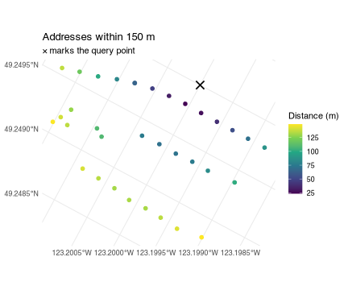

`cangeocode` reverse geocodes Canadian coordinates against Statistics Canada's
[National Address Repository](https://www.statcan.gc.ca/en/lode/databases/nar)
(NAR), a national list of civic addresses with coordinates. The package
downloads a NAR release once, imports it into a local
[DuckDB](https://duckdb.org) database, and then answers queries from that
database — no network access, no per-request rate limit, and no address ever
leaving your machine.

## One-time setup

Two things have to be true before the first call.

**Point the package at a cache directory.** `NAR_CACHE_PATH` says where the
database files go. It has no default, and every entry point errors out
immediately if it is unset. Put it in your `~/.Renviron` so it survives a
restart:

```
NAR_CACHE_PATH=~/data/nar
```

**Budget for the first download.** `nar_connection()` fetches the release from
StatCan, unzips it, and builds the database. That is a 1.7 GB download over a
connection slow enough that the package raises R's timeout to 20 minutes, and
it lands roughly **5 GB on disk** for the 2026-06 release. Every later call
reuses the file and opens instantly. In an interactive session the first call
asks whether you want all of it — see below.


``` r
library(cangeocode)
library(dplyr)

con <- open_nar()
```

`nar_connection()` is both the installer and the accessor: it downloads and
imports on first use for a given version, and simply opens the file after that.
`open_nar()` calls it and keeps the connection for the rest of the session, so
nothing below has to be handed a database. It returns the connection too, which
is what the direct database queries further down use.

Even that is optional. `reverse_geocode()` and `geocode()` open a connection
themselves when they are not given one, and keep it open the same way — the
first call is half a second slower and every call after it is not. `open_nar()`
is worth calling to do the opening at a moment of your choosing, or to name a
release other than the latest. `close_nar()` ends it, and every entry point
still takes an explicit `con` if you would rather own the connection yourself.

### Downloading one province instead of the country

The StatCan release is one zip whose member files are split by province, and
the server honours HTTP range requests. So the package can read the archive's
own index — a few kilobytes, no data transfer — and then fetch only the members
a province needs:


``` r
pei <- nar_connection(provinces = "PE")
```

That is 10 MB and about 40 seconds for a working Prince Edward Island
geocoder. British Columbia is 192 MB, Ontario 552 MB, the whole country
1,666 MB.

These are the same NAR rows, not a reduced product: a partial database returns
the same `ADDR_GUID` and the same coordinates a national one does. What it does
not have is anything outside its provinces, and `geocode()` says so —
`match_method` comes back as `not_covered` rather than `none`, because an
Ontario address asked of a PEI database is not a bad address.

Coverage is recorded in the database and checked before anything is
downloaded. Asking for a province you already have downloads nothing; asking
for one you do not adds just that province rather than rebuilding.


``` r
nar_provinces(pei)
#> [1] "PE"

both <- nar_connection(provinces = c("PE", "NB"))   # fetches New Brunswick only
nar_provinces(both)
#> [1] "NB" "PE"
```

Provinces can be named by abbreviation, by full name, or by SGC code, and
`provinces = "all"` is the whole country. `refresh = TRUE` rebuilds whatever
coverage the database already has, so refreshing a British Columbia database
does not silently turn it into a national one.

## Reverse geocoding a point

Hand `reverse_geocode()` a longitude/latitude pair and it returns every address
within the match radius, nearest first.


``` r
reverse_geocode(c(-123.2, 49.25), match_radius = 100) |>
  select(address, dist, geom_source)
#> # A tibble: 16 × 3
#>    address                                        dist geom_source
#>    <chr>                                         <dbl> <chr>      
#>  1 4176 W KING EDWARD AVE, VANCOUVER V6S1N3       23.5 building   
#>  2 4172 W KING EDWARD AVE, VANCOUVER V6S1N3       27.4 building   
#>  3 4182 W KING EDWARD AVE, VANCOUVER V6S1N3       32.3 building   
#>  4 4166 W KING EDWARD AVE, VANCOUVER V6S1N3       39.6 building   
#>  5 4188 W KING EDWARD AVE, VANCOUVER V6S1N3       46.9 building   
#>  6 4162 W KING EDWARD AVE, VANCOUVER V6S1N3       54.5 building   
#>  7 BSMT-4192 W KING EDWARD AVE, VANCOUVER V6S1N3  64.1 building   
#>  8 4192 W KING EDWARD AVE, VANCOUVER V6S1N3       64.1 building   
#>  9 4177 DONCASTER WAY, VANCOUVER V6S1W1           70.4 building   
#> 10 4158 W KING EDWARD AVE, VANCOUVER V6S1N3       70.5 building   
#> 11 4171 DONCASTER WAY, VANCOUVER V6S1W1           71.3 building   
#> 12 4169 DONCASTER WAY, VANCOUVER V6S1W1           75.5 building   
#> 13 4189 DONCASTER WAY, VANCOUVER V6S1W1           75.6 building   
#> 14 4204 W KING EDWARD AVE, VANCOUVER V6S1N3       81.8 building   
#> 15 4165 DONCASTER WAY, VANCOUVER V6S1W1           84.3 building   
#> 16 4154 W KING EDWARD AVE, VANCOUVER V6S1N3       88.0 building
```

`dist` is in **metres**. No conversion is needed: addresses are stored in a
projected CRS (Statistics Canada Lambert, EPSG:3347), so distances come out
metric already.

The default radius is 100 m. Widen it when you expect sparse coverage — rural
addresses, industrial land — and narrow it when you only want the building you
are standing on.


``` r
reverse_geocode(c(-123.2, 49.25), match_radius = 25) |>
  select(address, dist)
#> # A tibble: 1 × 2
#>   address                                   dist
#>   <chr>                                    <dbl>
#> 1 4176 W KING EDWARD AVE, VANCOUVER V6S1N3  23.5
```

### Coordinates in another CRS

A bare numeric pair is interpreted as EPSG:4326 — the longitude/latitude that
GPS receivers and web maps report. If your coordinates use a different CRS,
name it with `crs`, or pass an `sf` object and let its own CRS speak for itself.


``` r
pt <- sf::st_sfc(sf::st_point(c(-123.2, 49.25)), crs = 4326)
reverse_geocode(pt, match_radius = 50) |>
  select(address, dist)
#> # A tibble: 5 × 2
#>   address                                   dist
#>   <chr>                                    <dbl>
#> 1 4176 W KING EDWARD AVE, VANCOUVER V6S1N3  23.5
#> 2 4172 W KING EDWARD AVE, VANCOUVER V6S1N3  27.4
#> 3 4182 W KING EDWARD AVE, VANCOUVER V6S1N3  32.3
#> 4 4166 W KING EDWARD AVE, VANCOUVER V6S1N3  39.6
#> 5 4188 W KING EDWARD AVE, VANCOUVER V6S1N3  46.9
```

## Choosing what comes back

`output` controls the shape of the result.


``` r
# A single formatted string for the closest address
reverse_geocode(c(-123.2, 49.25), output = "address")
#> [1] "4176 W KING EDWARD AVE, VANCOUVER V6S1N3"
```


``` r
# One row, every NAR column, for the closest address
reverse_geocode(c(-123.2, 49.25), output = "components") |>
  select(CIVIC_NO, MAIL_STREET_NAME, MAIL_MUN_NAME, MAIL_POSTAL_CODE, BU_USE)
#> # A tibble: 1 × 5
#>   CIVIC_NO MAIL_STREET_NAME MAIL_MUN_NAME MAIL_POSTAL_CODE BU_USE
#>      <dbl> <chr>            <chr>         <chr>             <dbl>
#> 1     4176 KING EDWARD      VANCOUVER     V6S1N3                2
```

The default, `output = "multiple"`, is the full table of matches shown above.

When no address falls inside the radius the function warns and returns `NULL`,
so check for that rather than assuming a data frame comes back.


``` r
result <- reverse_geocode(c(-135, 65), match_radius = 100)
#> Warning in reverse_geocode(c(-135, 65), match_radius = 100): No address found
#> within 100 m radius.
is.null(result)
#> [1] TRUE
```

## Getting geometry back

`geometry = TRUE` returns an `sf` object carrying the matched address point, in
the database's storage CRS. Reproject it with `sf::st_transform()` if you need
something else.


``` r
matches <- reverse_geocode(c(-123.2, 49.25), match_radius = 150,
                           geometry = TRUE)
sf::st_crs(matches)$input
#> [1] "EPSG:3347"
```


``` r
library(ggplot2)

query <- sf::st_sfc(sf::st_point(c(-123.2, 49.25)), crs = 4326) |>
  sf::st_transform(sf::st_crs(matches))

ggplot(matches) +
  geom_sf(aes(colour = dist), size = 2) +
  geom_sf(data = query, shape = 4, size = 4, stroke = 1.2) +
  scale_colour_viridis_c(name = "Distance (m)") +
  labs(title = "Addresses within 150 m",
       subtitle = "× marks the query point") +
  theme_minimal()
```



## Precision: read `geom_source` before you trust `dist`

Not every NAR address has a building point. Where one is missing the package
falls back to the **blockface** point — the centroid of one side of a street
between two intersections — and records which was used in `geom_source`.


``` r
tbl(con, "Addresses") |>
  count(geom_source) |>
  collect() |>
  arrange(desc(n))
#> # A tibble: 3 × 2
#>   geom_source        n
#>   <chr>          <dbl>
#> 1 building    16157303
#> 2 blockface    1140090
#> 3 <NA>           65083
```

The difference matters. A building point is specific to the address. A
blockface point is shared by every address on that stretch of street. Among
the addresses that fall back to one, a blockface point stands in for a median
of 2 addresses and a mean of 3.9 — and in the worst case 578 of them sit on a
single identical coordinate. Where an address has both kinds of point, the
median distance between them is 50 m, and the 95th percentile is 331 m.

So a `dist` of 30 m from a blockface match does not mean the address is 30 m
away — it means the *middle of its block* is. Filter when only precise matches
will do:


``` r
reverse_geocode(c(-123.2, 49.25), match_radius = 150) |>
  filter(geom_source == "building") |>
  select(address, dist) |>
  head(3)
#> # A tibble: 3 × 2
#>   address                                   dist
#>   <chr>                                    <dbl>
#> 1 4176 W KING EDWARD AVE, VANCOUVER V6S1N3  23.5
#> 2 4172 W KING EDWARD AVE, VANCOUVER V6S1N3  27.4
#> 3 4182 W KING EDWARD AVE, VANCOUVER V6S1N3  32.3
```

A small number of addresses (about 65,000 nationally) have no coordinates at
all and can never be returned by a radius query.

## Geocoding many points

Nothing special is needed for a batch. `reverse_geocode()` reuses the session
connection, so the loop below opens the database once no matter how many points
go through it — and would do the same with no `open_nar()` above it, opening on
the first point and holding it for the rest.


``` r
points <- list(c(-123.2, 49.25), c(-79.4, 43.66), c(-73.58, 45.51))

lapply(points, \(p) reverse_geocode(p, output = "address")) |>
  unlist()
#> [1] "4176 W KING EDWARD AVE, VANCOUVER V6S1N3"
#> [2] "563 SPADINA CRES, TORONTO M5S2J7"        
#> [3] "475 O DES PINS AV, MONTRÉAL H2W1S4"
```

## Versions

NAR is republished periodically. `available_nar_versions()` lists what StatCan
offers; `nar_connection(version = ...)` pins a specific one, keyed by the
`path` column (`"YYYY-MM"`).


``` r
available_nar_versions() |>
  select(version, path, Date) |>
  head(4)
#> # A tibble: 4 × 3
#>   version       path    Date      
#>   <chr>         <chr>   <date>    
#> 1 June 2026     2026-06 2026-06-01
#> 2 December 2025 2025-12 2025-12-01
#> 3 July 2025     2025-07 2025-07-01
#> 4 December 2024 2024-12 2024-12-01
```

`"latest"` is the default. Version lookup checks your local cache before the
network, so naming a release you already have never touches StatCan — and if
you are offline and asked for `"latest"`, the package warns and falls back to
your newest cached database instead of failing.

Each version is a separate file in `NAR_CACHE_PATH`, so keeping two releases
around costs two databases' worth of disk. `refresh = TRUE` rebuilds one from
scratch.


``` r
close_nar()
```

## Where to go next

`vignette("geocoding")` covers the other direction — `geocode()`, which turns
an address string into a coordinate and reports how it was found and what that
cost, along with the address parser behind it and the BC geocoder you can check
a result against.

`vignette("querying-nar")` covers using the database directly — filtering the
full address table with dplyr, joining to `Locations` for federal riding and
economic region names, and converting results to `sf` with `collect_nar()`.
